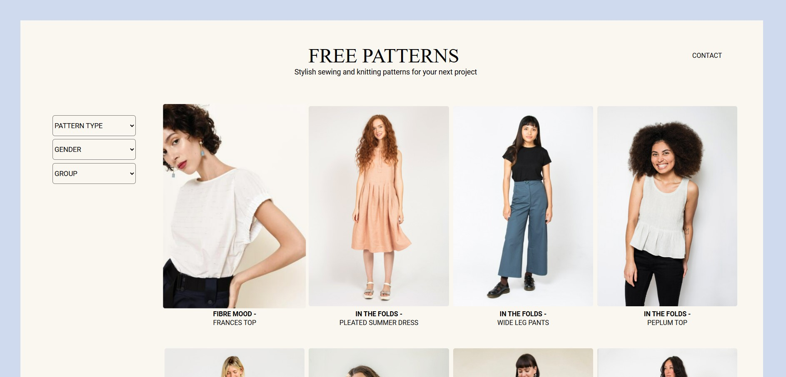
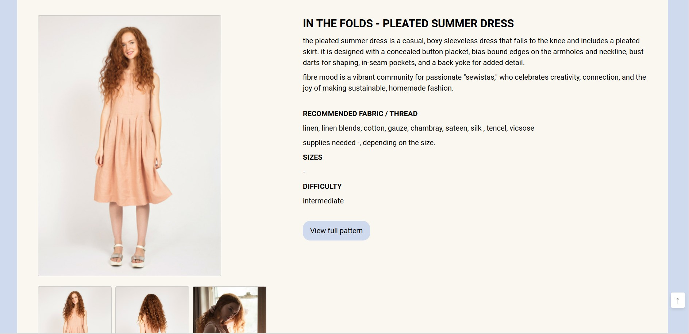

# Free Patterns
@ meemmi
## Description
**Free Patterns** is a web application designed to help crafting enthusiasts complete their projects with a lower cost. The site shows free sewing and knitting patterns from designers, making them easily accessible to everyone. This project was developed using React.js, Fetch API, and JavaScript. This project is currently under development. New features and updates are being actively worked on and the website will be published at a later date.

Stay tuned for updates <3

All images used in this project are copyrighted by their respective creators and not used for commercial use.
